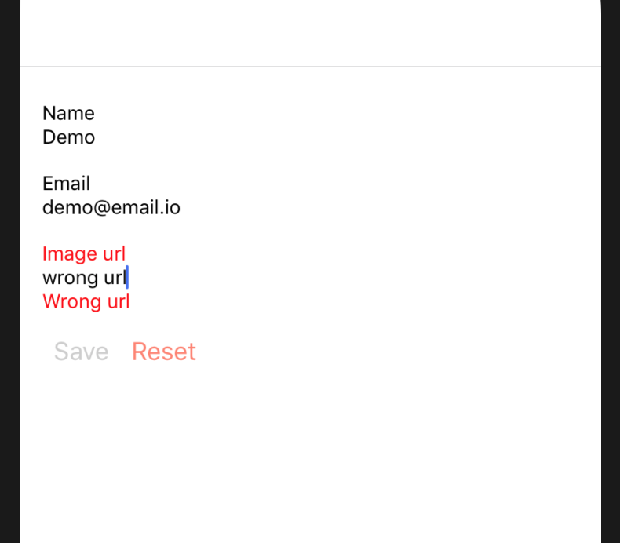

export { default as theme } from './slides-theme';
import { Appear } from 'mdx-deck';
import { CodeSurfer } from 'mdx-deck-code-surfer';
import vsDark from 'prism-react-renderer/themes/vsDark';
import { FullScreenCode } from 'mdx-deck/layouts';

# Introduction to ReactNative

---

## What is this workshop about?

<h4>I want to show you what is ReactNative and what are differences with React</h4>

---

## Are you ready?

  

---

# What is ReactNative?

<h4>React Native is like React, but it uses native components instead of web components as building blocks</h4>

---

# Styles

<ul>
  <Appear>
    <li>All of the core components accept a prop named style</li>
    <li>Usually match with CSS prop but in camel case(background-color will be backgroundColor)</li>
    <li>We will use <code>StyleSheet.create</code> to generate our styles</li>
    <li>Could be composables using array</li>
  </Appear>
</ul>

---

<CodeSurfer
  title="Style example"
  code={require('!raw-loader!./slide-examples/style.example')}
  lang="javascript"
  showNumbers
  theme={vsDark}
  steps={[
    { range: [4, 13], notes: 'Create styles' },
    { range: [19, 19], notes: 'usage' },
    { range: [21, 21], notes: 'array composition' },
    { range: [1, 26] }
  ]}
/>

---

# View

<ul>
  <Appear>
    <li>The most basic building block</li>
    <li>Used for styling and layout of children elements</li>
    <li>Flexbox</li>
  </Appear>
</ul>

---

# Text

<ul>
  <Appear>
    <li>Used to render text</li>
    <li>text must be wrapped with this component</li>
  </Appear>
</ul>

---

# Image

<ul>
  <Appear>
    <li>used to render images</li>
    <li>Images may either be bundled with the app as assets, or downloaded</li>
  </Appear>
</ul>

---

<CodeSurfer
  title="Image example"
  code={require('!raw-loader!./slide-examples/image.example')}
  lang="javascript"
  showNumbers
  theme={vsDark}
  steps={[
    { range: [8, 11], notes: 'image src url' },
    { range: [12, 15], notes: 'image src from app assets' },
    { range: [1, 28] }
  ]}
/>

---

# ScrollView

<ul>
  <Appear>
    <li>Used for scrollable content</li>
    <li>Small quantities of content (± 30 items)</li>
    <li>can scroll horizontally or vertically</li>
  </Appear>
</ul>

---

# Navigation

<ul>
  <Appear>
    <li>React Native doesn't have a built-in idea of a global history</li>
    <li>We gonna use react-navigation</li>
    <li>Provides a way for your app to transition between screens and manage navigation history</li>
  </Appear>
</ul>

---

<CodeSurfer
  title="react-navigation example"
  code={require('!raw-loader!./slide-examples/react-navigation.example')}
  lang="javascript"
  showNumbers
  theme={vsDark}
  steps={[
    { range: [7, 15], notes: 'HomeScreen class' },
    { range: [17, 25], notes: 'DetailScreen class' },
    { range: [27, 35], notes: 'Create stack navigatior' },
    { range: [1, 37] },
  ]}
/>

---

# What we gonna do?

#### We gonna do a contacts app 🙌🏼

#### This app will have a Tab navigtion bar that will include 3 options: Home, Contact and Settings

#### Home has list of contacts

#### Contact has form to be able to create users

#### Settings is a default tab with app settings

---

# Setup

- `git clone repo`
- `git checkout exercise1`
- `npm install -g expo-cli`
- `npm install`
- `npm start`

---

# Exercise 1

  

---

# Exercise 2

  

---

# Exercise 3

- Change current firebase base url to custom
- Change in ContactScreen `onSubmit` props to use `saveContact` and navigate to Home
- Change in HomeScreen `onDeleteClick` prop in all lists to use `deleteContact`
- Change in HomeScreen `onContactClick` prop to navigate to ContactScreen

---

# Feedback

  
  

<a href="https://forms.gle/VGB7ybiTvu4SUv6G9">It is only a minute please!</a>

---

# The end

  

<ul>
  <li>
    <a href="https://github.com/JonatanGarciaClavo/ContactsAppReactNative.git">
      https://github.com/JonatanGarciaClavo/ContactsAppReactNative.git
    </a>
  </li>
  <li>Jonatan García Clavo - jonatan.garcia@sytac.io</li>
</ul>
